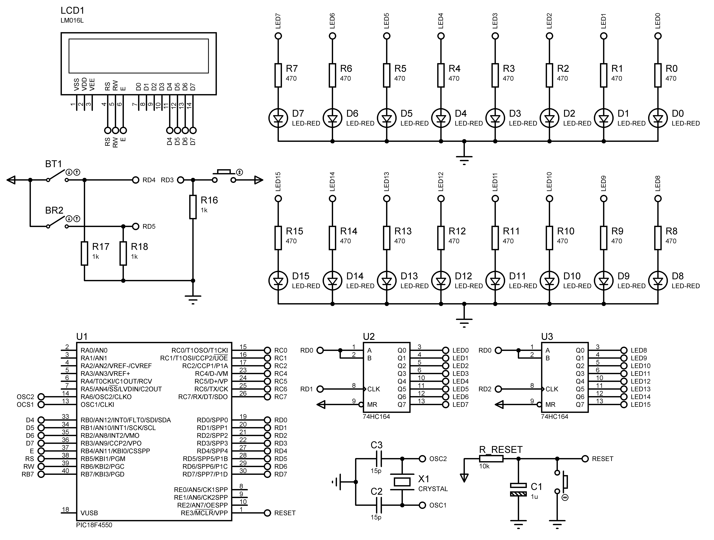

# Washing Machine

Firmware that simulates a washing machine

## Basic operation
- Wait for the Start key to be pressed;
- Simulate the filling of the tank, turning on the first led of a set of 8 leds, then the second led until reaching the last one, which corresponds to the full tank;
- Simulate the agitation of the tank, making the first led turn on, from another set of 8 leds, and then, turn off and turn on the second led, so on, going from right to left and vice versa, for a determined time;
- Simulate the emptying of the tank, extinguishing the last led of the set of 8 leds used in the ST_ filling state, then the penultimate led until reaching the first, which corresponds to the empty tank;
- Simulate the centrifugation process, making 4 less significant leds turn on and 4 more significant leds turn off, from the same set of 8 leds used in ST_agitating, and alternate between on and off, reducing the time interval between blinks, for example. a certain time.

## Advanced operation
- Implementation of the washing steps, called Drying;
- LCD to show the program and steps.
- Add two keys for the user to select 4 washing programs, as follows:
  | Key1  | Key2  | Program                             |
  |-------|-------|-------------------------------------|
  | 1     | 1     | normal cycle                        |
  | 1     | 0     | 2x rinses and 2x agitation          |
  | 0     | 1     | 3x rinses without shaking           |
  | 0     | 0     | 2x rinses without shaking + drying  |

## ☁️ Links

- [Basic Specifications](docs/pdf/basic_specification.pdf)
- [Advanced Specifications](docs/pdf/advanced_specification.pdf)

## 💻 Project

#### PICF184550


#### Hardware



#### Running Simulation


## 🚀 Technologies

 C ANSI

 Proteus

## 🏃 Usage

Before you compile the code you **have to install the [XC8 Compiler](http://www.microchip.com/mplabxc8windows)**, then just copy and paste one by one the commands bellow:

```
git clone https://github.com/douglasJovenil/washing-machine
cd washing-machine/src
xc8 -I../include  -I../lib/XLCD -I../lib/LCD -I../lib/74HC164 ../lib/XLCD/busyxlcd.c ../lib/XLCD/openxlcd.c ../lib/XLCD/putrxlcd.c ../lib/XLCD/putsxlcd.c ../lib/XLCD/readaddr.c ../lib/XLCD/readdata.c ../lib/XLCD/setcgram.c ../lib/XLCD/setddram.c ../lib/XLCD/wcmdxlcd.c ../lib/XLCD/writdata.c ../lib/LCD/LCD.c ../lib/74HC164/74HC164.c main.c -Ofirmware --chip=18f4550 --outdir=../build
```

On software Proteus, open the [simulation file](hardware/hardware.pdsprj), right click on PICF18F4550 and click on **edit properties**


Find the hex firmware, this file will be at [build](build) folder


Select the hex


Click on **OK** and then click on **play** to start the simulation

